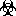

Quick restructuredText
======================

Inline Markup
-------------

*emphasis*, **strong**, `interpreted text`, ``inline literal``

Escaping with Backslashes
-------------------------

*escape* ``with`` "\"

\*escape\* \``with`` "\\"

Section Structure
-----------------

Titles are underlined (or over- and underlined) with a printing nonalphanumeric 7-bit ASCII character.
Recommended choices are "``=-`:'"~^_*+#<>``"

Paragraphs
----------

This is a paragraph

This is the second paragraph

Bullet lists
------------

* Asia
    + China
        - Beijing
        - Chongqing
        - Chengdu
    + Japan
    + India
* Europe
    + France
    + Germany
* America
* Africa

Enumerated Lists
----------------

1. frist item
#. second item
#. third item
#. fourth item

Definition lists
----------------

word
    This is the definiton
    of the word

Field Lists
-----------

:author:
    Tony,
    David
:versoin: 1.0
:dedication: to my father

Option Lists
------------

-a          command option "a"
-b file     option with an
            argument
--long      long option
--input=file    long option with
                argument
/v          DOS-style option

There must be at least two spaces between the option and the description.

Literal Blocks
--------------

::

    Whitesapce, newline, blank lines

    and all kinds of makup (like *this*
    or \this) is preserved by literal blocks.

    The paragraph containing only '::'
    will be omitted from the result.

The ``::`` may be tacked onto the very
end of any paragraph. The ``::`` will be
omitted if it is preceded by whitespace.
The ``::`` will be converted to a single
colon if preceded by text, like this::

    It's very convenient to use this form.

Literal blocks end when text returns to
the preceding paragraph's indentation.
This means that something like this
is possible::

            We start here

        and continue here

    and end here.

Per-line quoting can also be used on
unindented literal blocks::

> Useful for quotes from email and
> for Haskell literate programming.

Line Blocks
-----------

| Each new line begins with "|":
|   line breaks and initial indents
|   are preserved.
| Continuation lines are wrapped
  portions of long lines; they begin
  with spaces in place of vertical bers

Block Quotes
------------

Block quotes are just:
    indented paragraphs,
        and they may nest.

Doctest Blocks
--------------

Doctest blocks are interactive
Python sessions. They begin with
"``>>>``" and end with a blank line.

>>> print("this is a doctest block.")
this is a doctest block.

Tables
------

Grid table:

+------------+-----------+--------------+
| Header 1   | Header 2  | Header 3     |
+============+===========+==============+
| body row 1 | column 2  | column 3     |
+------------+-----------+--------------+
| body row 2 | cells may span columns.  |
+------------+-----------+--------------+
| body row 3 | cells may | - Cells      |
+------------+ span rows | - contain    |
| body row 4 |           | - blocks.    |
+------------+-----------+--------------+

Simple table:

===== ===== ======
  Inputs    Output
----------- ------
  A     B   A or B
===== ===== ======
False False False
True  False True
False True  True
True  True  True
===== ===== ======

Transitions
-----------

A transition marker is horizontal line
of 4 or more repeated punctuation
characters.

----

A transition should not begin or end a
section or document. nor should two
transitions be immediately adjacent.

Explicit Markup
---------------

Begin with ".. ", means the "explicit markup start".

Footnotes
'''''''''

Autonumbered footnotes like using [#]_ and [#]_.

----

.. [#] This is the first one.
.. [#] This is the second one.

Hyperlink Targets
'''''''''''''''''

External like `Baidu <https://www.baidu.com>`_ or Python_.

.. _Python: https://www.python.org/

Internal cross-reference, like example_.

.. _example:

This is an example cross-reference target.

IF_ is `my favourite news site`__.

.. _IF: https:www.ifeng.com
__ IF_

Implicit references. like go to `Field Lists`_.

Directives
''''''''''

Directives are a general-purpose extension mechanism, a way of adding support for new constructs without adding new syntax:

Substitution References and Definitions
'''''''''''''''''''''''''''''''''''''''

Substitutions are like inline directives, allowing graphics and arbitrary constructs within text:

The |biohazard| symbol must be used on containers used to dispose of medical waste.

Comments
''''''''

Any text which begins with an explicit markup start but doesn't use the syntax of any of the constructs above, is a comment.

.. This text will not be shown
   (but, for instance, in HTML might be rendered as HTML comment)

An "empty comment" does not
consume following blocks.
(An empty comment is ".." with
blank lines before and after.)

..

    so this block is not "lost",
    despite its indentation. 